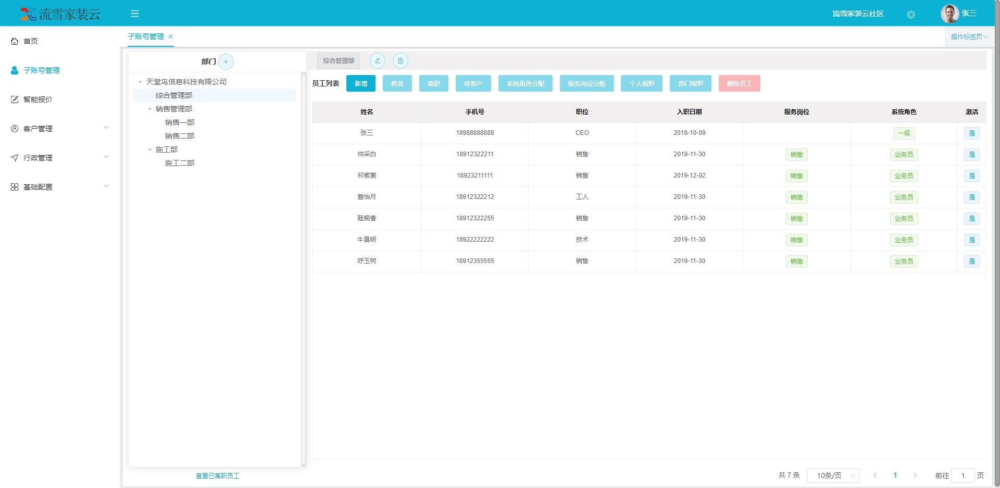

**项目说明** 
- 支持多租户模式的装修管理平台。
- 采用轻量级的开发框架，适合在项目基础上进行二次开发。
- 目前已开发多个常用的装修管理模块，后续开发计划根据需求决定。
  

**开发框架特点** 

- 友好的代码结构及注释，便于阅读及二次开发
- 实现前后端分离，通过token进行数据交互，前端再也不用关注后端技术
- 灵活的权限控制，可控制到页面或按钮，满足绝大部分的权限需求
- 页面交互使用Vue2.x，极大的提高了开发效率
- 完善的代码生成机制，可在线生成entity、xml、dao、service、vue、sql代码，减少70%以上的开发任务
- 引入quartz定时任务，可动态完成任务的添加、修改、删除、暂停、恢复及日志查看等功能
- 引入API模板，根据token作为登录令牌，极大的方便了APP接口开发
- 引入Hibernate Validator校验框架，轻松实现后端校验
- 引入云存储服务，已支持：七牛云、阿里云、腾讯云等
- 引入swagger文档支持，方便编写API接口文档
<br> 

**项目结构** 

```
├─snow-decoration 
  ├─dc-admin 后端服务
    ├─db  项目SQL语句
    │
    ├─common 公共模块
    │  ├─aspect 系统日志
    │  ├─exception 异常处理
    │  ├─validator 后台校验
    │  └─xss XSS过滤
    │ 
    ├─config 配置信息
    │ 
    ├─modules 功能模块
    │  ├─app API接口模块(APP调用)
    │  ├─job 定时任务模块
    │  ├─oss 文件服务模块
    │  ├─sys 权限模块
    │  └─tx 装修业务模块
    │ 
    ├─TtnApplication 项目启动类
    │  
    ├──resources 
    │  ├─mapper SQL对应的XML文件
    │  └─static 静态资源
  ├─code-generator	代码生成器
  ├─dc-web	前端代码

```


**技术选型：** 
- 核心框架：Spring Boot 2.0
- 安全框架：Apache Shiro 1.4
- 视图框架：Spring MVC 5.0
- 持久层框架：MyBatis 3.3
- 定时器：Quartz 2.3
- 数据库连接池：Druid 1.0
- 日志管理：SLF4J 1.7、Log4j
- 页面交互：Vue2.x 
<br> 


 **后端部署**
- 通过git下载源码
- 创建数据库ttn-decoration，数据库编码为UTF-8
- 执行db/mysql.sql文件，初始化数据
- 修改application-dev.yml，更新MySQL账号和密码
- Eclipse、IDEA运行TtnApplication.java，则可启动项目
- Swagger路径：http://localhost:8080/swagger/index.html

<br> 

 **前端部署**
 - 前端代码：dc-web
 - 本项目是前后端分离的，还需要部署前端，才能运行起来
 - 前端部署完毕，就可以访问项目了
 - 客户账号：wh，密码：admin
 - 超管账号：czczj，密码：admin

 <br>

###### 项目截图：

客户侧-子账号管理




